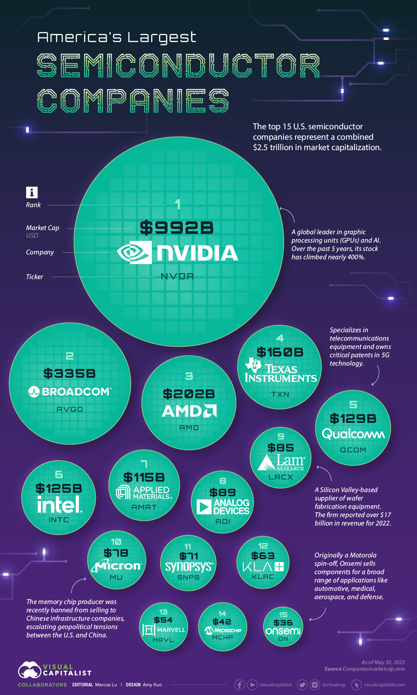

### Dataset

Si consideri la seguente visualizzazione relativa alla alle aziende produttrici di semiconduttori.




## Design

Riprogettare la visualizzazione in modo da risolvere i problemi evidenziati nell'analisi svolta durante l'esame.

È importante che l'Rmd possa essere lanciato senza problemi con il pulsante *Run Document*.

```{r librerie, include=FALSE, warning=FALSE}
#librerie
library(tidyverse)
library(shiny)
library(ggrepel)
```

```{r funzioni, include=FALSE, warning=FALSE}
#funzioni utili

#rimuove il carattere n-esimo dalla stringa s
rimuoviCarattere<-function(s, n){
  return(paste(substr(s, 1, n-1), substr(s, n+1, nchar(s)), sep=""))
}

#funzione per non far sovrapporre le etichette sull'asse x (nomi delle aziende)
acapo<-function(s){
  return(gsub(" ", "\n", s)) #sostituisce ogni spazio con un '\n'
}
```

```{r dati, include=FALSE, warning=FALSE}
#dati
dati<-read_csv("semiconductor.csv",
               col_types=cols(
                 Rank="double",
                 Company="factor",
                 Ticker="factor",
                 `Market Cap (USD billions)`="character",
                 `YTD Return`="character"
               )) %>% 
  rename(Rank=1, Company=2, Ticker=3, Capital=4, YDT=5) %>%
  mutate(Rank=as.double(Rank)) %>%
  mutate(Company=as_factor(Company)) %>%
  mutate(Ticker=as_factor(Ticker)) %>%
  mutate(Capital=as.double(rimuoviCarattere(Capital, 1))) %>% #rimuove "$"
  mutate(YDT=as.double(rimuoviCarattere(as.character(YDT), nchar(as.character(YDT))))) #rimuove "%"
```

```{r UI, echo=FALSE, warning=FALSE}
#User Interface
radioButtons("sortDirection", "Direction:", choiceNames=c("Descending","Ascending"), choiceValues=c(-1, 1), inline=TRUE)
checkboxInput("checkButton","Show values", value=TRUE)
```

```{r output, echo=FALSE, warning=FALSE}
#plot
plotOutput("plot", width=1024, height=768)
```

```{r server, echo=FALSE, warning=FALSE}
#Server

#ordinamento
ordinaDati<-reactive({
  dati %>% 
    mutate(Company=as_factor(acapo(as.character(Company)))) %>% #i nomi delle compagnie sono lunghi e potrebbero sovrapporsi tra loro lungo l'asse x, la funzione "acapo" garantisce che non succeda
    mutate(Company = fct_reorder(Company, as.numeric(input$sortDirection)*dati[["Capital"]])) #ordina per capitale crescente o decrescente in base all'input 
})

#renderplot
output$plot<-renderPlot({ 
  
  grafico<-ggplot(ordinaDati(), aes(x=Company, y=Capital))+
    ggtitle("America's Largest Semiconductor Companies")+
    xlab("Company")+
    ylab("Market Cap ($ USD)")+
    scale_x_discrete()+
    scale_y_continuous(labels=scales::label_dollar(prefix="", suffix="B"))+
    geom_col(fill="darkblue", width=0.85)+
    geom_hline(yintercept=mean(dati$Capital), linetype = "dashed")+
    theme_minimal()+
    theme(panel.grid.major.y=element_blank(),
          plot.title=element_text(size=26, face="bold"),
          axis.title.x=element_text(size=14, face="bold"),
          axis.title.y=element_text(size=14, face="bold"),
          axis.text.x=element_text(size=10),
          axis.text.y=element_text(size=10))+
    if(input$checkButton)
         geom_text(aes(label=paste0("$", Capital, "B")), color="black", size=4, vjust=-0.5)
  
  grafico
})
```
